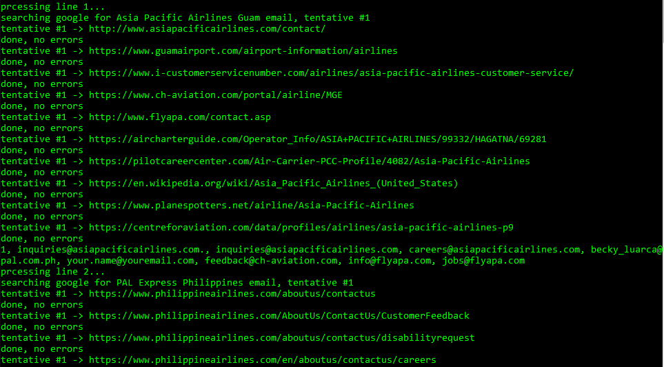

# scrape
a proof of concept on harvesting email addresses related to certain keywords

# how it works
given a text file *default.txt* where each line contains keywords related to a person, company, etc. the program uses online search to look for email addresses related to those keywords. It scrapes the results and extracts email addresses. It will generate a csv file *result.txt* where each line starts by its number and continues with found emails separated by a comma. User can play on the constants like the maximum number of results, of tries, etc. to customize the behaviour

# example
the folder contains one sample input file and its corresponding results

# notes
- program uses regex, it's slow when processing binary results (pdf, docs...)
- some false positives might accur as TLD's are not checked (could return example@sample.jpg thinking it's an email address)
- **please do not misuse!**

